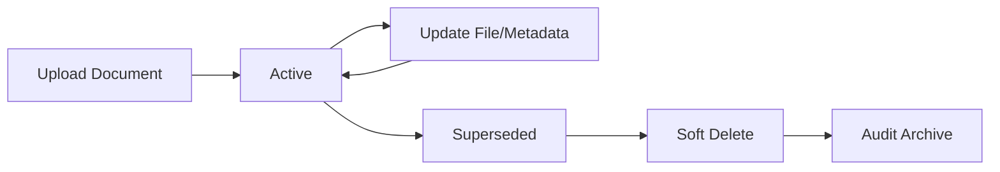

## Overview

The Aircraft Documents API enables you to upload, organize, and manage all aircraft-related documentation. The system supports 24+ standardized document types and handles PDF file uploads with automatic storage management.

## Document Types

The API supports the following document types:

### Manuals
- `AIRCRAFT_FLIGHT_MANUAL` - Aircraft Flight Manual (AFM)
- `MAINTENANCE_MANUAL` - Maintenance Manual
- `STRUCTURAL_REPAIR_MANUAL` - Structural Repair Manual (SRM)
- `WIRING_DIAGRAM_MANUAL` - Wiring Diagram Manual
- `ILLUSTRATED_PARTS_CATALOG` - Illustrated Parts Catalog (IPC)
- `WEIGHT_AND_BALANCE_MANUAL` - Weight and Balance Manual
- `OPERATIONS_MANUAL` - Operations Manual
- `TRAINING_MANUAL` - Training Manual
- `QUICK_REFERENCE_HANDBOOK` - Quick Reference Handbook (QRH)

### Configuration
- `MINIMUM_EQUIPMENT_LIST` - Minimum Equipment List (MEL)
- `CONFIGURATION_DEVIATION_LIST` - Configuration Deviation List (CDL)

### Regulatory
- `SERVICE_BULLETIN` - Service Bulletin (SB)
- `AIRWORTHINESS_DIRECTIVE` - Airworthiness Directive (AD)

### Certificates
- `CERTIFICATE_OF_AIRWORTHINESS` - Certificate of Airworthiness
- `REGISTRATION_CERTIFICATE` - Registration Certificate
- `NOISE_CERTIFICATE` - Noise Certificate

### Logbooks
- `AIRCRAFT_LOGBOOK` - Aircraft Logbook
- `ENGINE_LOGBOOK` - Engine Logbook
- `PROPELLER_LOGBOOK` - Propeller Logbook
- `MAINTENANCE_LOG` - Maintenance Log
- `TECHNICAL_LOG` - Technical Log

### Operational Records
- `FLIGHT_PLAN` - Flight Plan
- `LOAD_SHEET` - Load and Trim Sheet
- `JOURNEY_LOG` - Journey Log

### Other
- `OTHER` - Miscellaneous documents

---

## Create Aircraft Document

<ParamField path="POST /aircraft-docs" type="endpoint">
  Upload a new aircraft document with PDF file
</ParamField>

**Authentication:** Required (JWT cookie)

**Permissions:** `mantenimiento:write`

**Content Type:** `multipart/form-data`

### Request Parameters

<ParamField body="file" type="file" required>
  PDF document file
</ParamField>

<ParamField body="aircraft_id" type="integer" required>
  ID of the aircraft this document belongs to
</ParamField>

<ParamField body="name" type="string" required>
  Document name or title
</ParamField>

<ParamField body="type" type="enum" required>
  Document type (see list above)
</ParamField>

<ParamField body="description" type="string" required>
  Detailed description of the document content
</ParamField>

### Response

<ResponseField name="message" type="string">
  Success message
</ResponseField>

<ResponseField name="aircraftDoc" type="object">
  Created document object
  
  <ResponseField name="id" type="integer">
    Unique document identifier
  </ResponseField>
  
  <ResponseField name="name" type="string">
    Document name
  </ResponseField>
  
  <ResponseField name="type" type="string">
    Document type
  </ResponseField>
  
  <ResponseField name="description" type="string">
    Document description
  </ResponseField>
  
  <ResponseField name="url_file" type="string">
    URL to access the uploaded PDF file
  </ResponseField>
  
  <ResponseField name="created_at" type="datetime">
    Upload timestamp
  </ResponseField>
  
  <ResponseField name="updated_at" type="datetime">
    Last modification timestamp
  </ResponseField>
</ResponseField>

### Example Request

```bash
curl -X POST https://api.sigsaho.com/aircraft-docs \
  -H "Content-Type: multipart/form-data" \
  --cookie "auth-token=YOUR_JWT_TOKEN" \
  -F "file=@/path/to/manual.pdf" \
  -F "aircraft_id=1" \
  -F "name=Bell 206B-3 Flight Manual" \
  -F "type=AIRCRAFT_FLIGHT_MANUAL" \
  -F "description=Complete flight manual including performance charts and operating procedures"
```

---

## List Aircraft Documents

<ParamField path="GET /aircraft-docs" type="endpoint">
  Retrieve paginated list of documents with optional filters
</ParamField>

**Authentication:** Required (JWT cookie)

**Permissions:** `despacho:read`

### Query Parameters

<ParamField query="page" type="integer" default="1">
  Page number (minimum: 1)
</ParamField>

<ParamField query="limit" type="integer" default="10">
  Records per page (minimum: 1, maximum: 100)
</ParamField>

<ParamField query="aircraft_id" type="integer">
  Filter by aircraft ID
</ParamField>

<ParamField query="type" type="string">
  Filter by document type
</ParamField>

<ParamField query="search" type="string">
  Search by document name or description
</ParamField>

### Response

<ResponseField name="data" type="array">
  Array of aircraft document objects
</ResponseField>

<ResponseField name="pagination" type="object">
  Pagination metadata with page, limit, total, totalPages, hasNextPage, hasPreviousPage
</ResponseField>

### Example Request

```bash
curl -X GET "https://api.sigsaho.com/aircraft-docs?aircraft_id=1&type=AIRCRAFT_FLIGHT_MANUAL&page=1&limit=20" \
  --cookie "auth-token=YOUR_JWT_TOKEN"
```

---

## Get Documents by Aircraft

<ParamField path="GET /aircraft-docs/aircraft/{aircraftId}" type="endpoint">
  Retrieve all documents for a specific aircraft
</ParamField>

**Authentication:** Required (JWT cookie)

**Permissions:** `despacho:read`

### Path Parameters

<ParamField path="aircraftId" type="integer" required>
  Aircraft ID
</ParamField>

### Query Parameters

<ParamField query="page" type="integer" default="1">
  Page number
</ParamField>

<ParamField query="limit" type="integer" default="10">
  Records per page (max 100)
</ParamField>

<ParamField query="type" type="string">
  Filter by document type
</ParamField>

<ParamField query="search" type="string">
  Search by name or description
</ParamField>

### Response

<ResponseField name="data" type="array">
  Array of documents for the specified aircraft
</ResponseField>

<ResponseField name="pagination" type="object">
  Pagination metadata
</ResponseField>

### Example Request

```bash
curl -X GET "https://api.sigsaho.com/aircraft-docs/aircraft/1?type=CERTIFICATE_OF_AIRWORTHINESS" \
  --cookie "auth-token=YOUR_JWT_TOKEN"
```

---

## Get Document by ID

<ParamField path="GET /aircraft-docs/{id}" type="endpoint">
  Retrieve detailed information for a specific document
</ParamField>

**Authentication:** Required (JWT cookie)

**Permissions:** `despacho:read`

### Path Parameters

<ParamField path="id" type="integer" required>
  Document ID
</ParamField>

### Response

<ResponseField name="aircraftDoc" type="object">
  Complete document object including:
  - Document metadata (name, type, description)
  - File URL (`url_file`)
  - Associated aircraft information
  - Timestamps (created_at, updated_at, deleted_at)
</ResponseField>

### Example Request

```bash
curl -X GET https://api.sigsaho.com/aircraft-docs/1 \
  --cookie "auth-token=YOUR_JWT_TOKEN"
```

---

## Update Document

<ParamField path="PUT /aircraft-docs/{id}" type="endpoint">
  Update document metadata and optionally replace the PDF file
</ParamField>

**Authentication:** Required (JWT cookie)

**Permissions:** `despacho:write`

**Content Type:** `multipart/form-data`

### Path Parameters

<ParamField path="id" type="integer" required>
  Document ID to update
</ParamField>

### Request Parameters

All fields are optional. Only provided fields will be updated.

<ParamField body="file" type="file">
  New PDF file (optional). If provided, replaces the existing file and deletes the old one.
</ParamField>

<ParamField body="name" type="string">
  Updated document name
</ParamField>

<ParamField body="type" type="enum">
  Updated document type
</ParamField>

<ParamField body="description" type="string">
  Updated description
</ParamField>

### Response

<ResponseField name="message" type="string">
  Success message
</ResponseField>

<ResponseField name="aircraftDoc" type="object">
  Updated document object
</ResponseField>

### Example Request

```bash
# Update metadata only
curl -X PUT https://api.sigsaho.com/aircraft-docs/1 \
  -H "Content-Type: multipart/form-data" \
  --cookie "auth-token=YOUR_JWT_TOKEN" \
  -F "name=Updated Flight Manual" \
  -F "description=Revised edition with updated performance charts"

# Update metadata and replace file
curl -X PUT https://api.sigsaho.com/aircraft-docs/1 \
  -H "Content-Type: multipart/form-data" \
  --cookie "auth-token=YOUR_JWT_TOKEN" \
  -F "file=@/path/to/updated-manual.pdf" \
  -F "name=Updated Flight Manual Rev 2" \
  -F "description=Latest revision with 2026 amendments"
```

---

## Delete Document

<ParamField path="DELETE /aircraft-docs/{id}" type="endpoint">
  Soft delete a document and remove its associated file
</ParamField>

**Authentication:** Required (JWT cookie)

**Permissions:** `despacho:write`

**Note:** This performs a soft delete (sets `deleted_at` timestamp) and removes the physical PDF file from storage.

### Path Parameters

<ParamField path="id" type="integer" required>
  Document ID to delete
</ParamField>

### Response

<ResponseField name="message" type="string">
  Deletion confirmation message
</ResponseField>

### Example Request

```bash
curl -X DELETE https://api.sigsaho.com/aircraft-docs/1 \
  --cookie "auth-token=YOUR_JWT_TOKEN"
```

---

## Document Management Best Practices

### Organizing Documents

1. **Use Consistent Naming**: Follow a standard naming convention
   - Good: `Bell 206B-3 Flight Manual - Rev 5 (2026-01)"`
   - Avoid: `manual.pdf` or `doc1.pdf`

2. **Leverage Document Types**: Always use the most specific document type rather than `OTHER`

3. **Detailed Descriptions**: Include:
   - Revision number or date
   - Scope of content
   - Relevant serial numbers or applicability
   - Any special notes or restrictions

### File Requirements

<Warning>
  Only PDF files are accepted. Other formats (Word, Excel, images) must be converted to PDF before upload.
</Warning>

**PDF Best Practices:**
- Ensure PDFs are searchable (OCR if needed)
- Optimize PDFs before upload for faster access
- Use bookmarks for multi-section documents
- Remove sensitive metadata if necessary

### Version Control

When updating documents:

1. **Major Revisions**: Create a new document entry
2. **Minor Updates**: Use the `PUT /aircraft-docs/{id}` endpoint to replace the file
3. **Keep Old Versions**: Before deleting, consider archiving superseded documents

### Document Lifecycle



---

## Common Use Cases

### Upload Required Certificates

```bash
# Certificate of Airworthiness
curl -X POST https://api.sigsaho.com/aircraft-docs \
  --cookie "auth-token=YOUR_JWT_TOKEN" \
  -F "file=@/docs/airworthiness-cert.pdf" \
  -F "aircraft_id=1" \
  -F "name=Certificate of Airworthiness" \
  -F "type=CERTIFICATE_OF_AIRWORTHINESS" \
  -F "description=Valid until 2027-12-31, Serial #ABC123"

# Registration Certificate
curl -X POST https://api.sigsaho.com/aircraft-docs \
  --cookie "auth-token=YOUR_JWT_TOKEN" \
  -F "file=@/docs/registration.pdf" \
  -F "aircraft_id=1" \
  -F "name=Registration Certificate XA-ABC" \
  -F "type=REGISTRATION_CERTIFICATE" \
  -F "description=Mexican registration, issued 2020-05-15"
```

### Retrieve All Manuals for Pre-Flight Review

```bash
curl -X GET "https://api.sigsaho.com/aircraft-docs/aircraft/1?type=AIRCRAFT_FLIGHT_MANUAL" \
  --cookie "auth-token=YOUR_JWT_TOKEN"
```

### Update Airworthiness Directive After Compliance

```bash
curl -X PUT https://api.sigsaho.com/aircraft-docs/15 \
  --cookie "auth-token=YOUR_JWT_TOKEN" \
  -F "file=@/docs/ad-complied.pdf" \
  -F "description=AD 2026-05-12 complied on 2026-03-01, 5,250 hrs"
```

### Search for Service Bulletins

```bash
curl -X GET "https://api.sigsaho.com/aircraft-docs?type=SERVICE_BULLETIN&search=engine" \
  --cookie "auth-token=YOUR_JWT_TOKEN"
```

---

## Document Storage

**File Storage:**
- Development: Local filesystem
- Production: AWS S3 or equivalent cloud storage
- Files are automatically optimized and securely stored
- Old files are removed when documents are updated or deleted

**Access Control:**
- All document URLs are authenticated
- Direct file access requires valid session
- URLs may be signed/temporary depending on storage configuration

**Retention:**
- Soft-deleted documents are retained for audit purposes
- Physical files are removed on deletion
- Consult your system administrator for backup and retention policies
