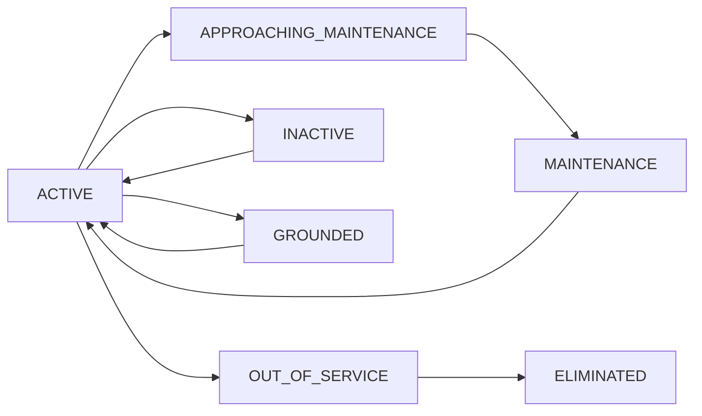

## Create Aircraft

<ParamField path="POST /aircrafts" type="endpoint">
  Create a new aircraft with image upload
</ParamField>

**Authentication:** Required (JWT cookie)

**Permissions:** `despacho:write`

**Content Type:** `multipart/form-data`

### Request Parameters

<ParamField body="name" type="string" required>
  Aircraft name or identifier
</ParamField>

<ParamField body="registration" type="string" required>
  Aircraft registration number (must be unique)
</ParamField>

<ParamField body="description" type="string" required>
  Detailed description of the aircraft
</ParamField>

<ParamField body="image" type="file" required>
  Aircraft image (JPEG, PNG, or WebP, max 10MB). Image will be automatically optimized to 85% quality.
</ParamField>

<ParamField body="aircraft_category" type="enum" required>
  Aircraft category:
  - `ROTARY_WING`: Helicopters
  - `FIXED_WING`: Airplanes
</ParamField>

<ParamField body="number_of_engines" type="integer" default="1">
  Number of engines (1 or 2)
</ParamField>

<ParamField body="manufacturer" type="string">
  Aircraft manufacturer name
</ParamField>

<ParamField body="model" type="string">
  Aircraft model designation
</ParamField>

<ParamField body="time_limit_m1" type="number" required>
  Engine 1 time limit (hours) before maintenance
</ParamField>

<ParamField body="time_limit_m2" type="number">
  Engine 2 time limit (hours) - required for twin-engine aircraft
</ParamField>

<ParamField body="cicle_limit_m1" type="integer" required>
  Engine 1 cycle limit before maintenance
</ParamField>

<ParamField body="cicle_limit_m2" type="integer">
  Engine 2 cycle limit - required for twin-engine aircraft
</ParamField>

<ParamField body="weight_empty" type="number" required>
  Empty weight (kg)
</ParamField>

<ParamField body="cg_empty" type="number" required>
  Center of gravity empty (inches)
</ParamField>

<ParamField body="moment_empty" type="number" required>
  Empty moment (lb-in)
</ParamField>

<ParamField body="max_passengers" type="integer" required>
  Maximum passenger capacity
</ParamField>

<ParamField body="total_lifetime_hours" type="number" default="0">
  Total accumulated flight hours
</ParamField>

### Response

<ResponseField name="message" type="string">
  Success message
</ResponseField>

<ResponseField name="aircraft" type="object">
  The created aircraft object with all fields including:
  
  <ResponseField name="id" type="integer">
    Unique aircraft identifier
  </ResponseField>
  
  <ResponseField name="name" type="string">
    Aircraft name
  </ResponseField>
  
  <ResponseField name="registration" type="string">
    Aircraft registration number
  </ResponseField>
  
  <ResponseField name="img_url" type="string">
    URL to the uploaded and optimized image
  </ResponseField>
  
  <ResponseField name="status" type="enum">
    Current aircraft status: `ACTIVE`, `INACTIVE`, `MAINTENANCE`, `APPROACHING_MAINTENANCE`, `GROUNDED`, `OUT_OF_SERVICE`, or `ELIMINATED`
  </ResponseField>
  
  <ResponseField name="current_time_flying" type="number">
    Current accumulated flight hours
  </ResponseField>
  
  <ResponseField name="current_cycles" type="number">
    Current accumulated flight cycles
  </ResponseField>
  
  <ResponseField name="available_time" type="number">
    Calculated: Remaining hours before next maintenance
  </ResponseField>
  
  <ResponseField name="maintenance_due_percentage" type="number">
    Percentage of maintenance interval completed (0-100)
  </ResponseField>
  
  <ResponseField name="created_at" type="datetime">
    Creation timestamp
  </ResponseField>
</ResponseField>

### Example Request

```bash
curl -X POST https://api.sigsaho.com/aircrafts \
  -H "Content-Type: multipart/form-data" \
  --cookie "auth-token=YOUR_JWT_TOKEN" \
  -F "name=Bell 206 JetRanger" \
  -F "registration=XA-ABC" \
  -F "description=Bell 206B-3 JetRanger III for passenger transport" \
  -F "image=@/path/to/aircraft.jpg" \
  -F "aircraft_category=ROTARY_WING" \
  -F "number_of_engines=1" \
  -F "manufacturer=Bell Helicopter" \
  -F "model=206B-3" \
  -F "time_limit_m1=2200" \
  -F "cicle_limit_m1=4000" \
  -F "weight_empty=1500" \
  -F "cg_empty=122.5" \
  -F "moment_empty=183750" \
  -F "max_passengers=4"
```

---

## List Aircraft

<ParamField path="GET /aircrafts" type="endpoint">
  Retrieve paginated list of aircraft with optional filters
</ParamField>

**Authentication:** Required (JWT cookie)

**Permissions:** `despacho:read`

### Query Parameters

<ParamField query="page" type="integer" default="1">
  Page number (minimum: 1)
</ParamField>

<ParamField query="limit" type="integer" default="10">
  Records per page (minimum: 1, maximum: 100)
</ParamField>

<ParamField query="status" type="enum">
  Filter by aircraft status:
  - `ACTIVE`
  - `INACTIVE`
  - `ELIMINATED`
  - `APPROACHING_MAINTENANCE`
  - `MAINTENANCE`
  - `GROUNDED`
  - `OUT_OF_SERVICE`
</ParamField>

<ParamField query="search" type="string">
  Search by aircraft name or registration number
</ParamField>

### Response

<ResponseField name="data" type="array">
  Array of aircraft objects with calculated virtual fields
</ResponseField>

<ResponseField name="pagination" type="object">
  Pagination metadata
  
  <ResponseField name="page" type="integer">
    Current page number
  </ResponseField>
  
  <ResponseField name="limit" type="integer">
    Records per page
  </ResponseField>
  
  <ResponseField name="total" type="integer">
    Total number of records
  </ResponseField>
  
  <ResponseField name="totalPages" type="integer">
    Total number of pages
  </ResponseField>
  
  <ResponseField name="hasNextPage" type="boolean">
    Whether there is a next page
  </ResponseField>
  
  <ResponseField name="hasPreviousPage" type="boolean">
    Whether there is a previous page
  </ResponseField>
</ResponseField>

### Example Request

```bash
curl -X GET "https://api.sigsaho.com/aircrafts?page=1&limit=20&status=ACTIVE" \
  --cookie "auth-token=YOUR_JWT_TOKEN"
```

---

## Get Aircraft by ID

<ParamField path="GET /aircrafts/{id}" type="endpoint">
  Retrieve detailed information for a specific aircraft
</ParamField>

**Authentication:** Required (JWT cookie)

**Permissions:** `despacho:read`

### Path Parameters

<ParamField path="id" type="integer" required>
  Aircraft ID
</ParamField>

### Response

<ResponseField name="aircraft" type="object">
  Complete aircraft object including:
  - All base fields (name, registration, specs, etc.)
  - Calculated fields (`available_time`, `maintenance_due_percentage`)
  - Timestamps (created_at, updated_at, deleted_at)
</ResponseField>

### Example Request

```bash
curl -X GET https://api.sigsaho.com/aircrafts/1 \
  --cookie "auth-token=YOUR_JWT_TOKEN"
```

---

## Search Aircraft by Registration

<ParamField path="GET /aircrafts/search/registration" type="endpoint">
  Search aircraft by partial registration match (LIKE query)
</ParamField>

**Authentication:** Required (JWT cookie)

**Permissions:** `despacho:read`

### Query Parameters

<ParamField query="registration" type="string" required>
  Partial registration text to search (case-insensitive)
</ParamField>

<ParamField query="page" type="integer" default="1">
  Page number
</ParamField>

<ParamField query="limit" type="integer" default="10">
  Records per page (max 100)
</ParamField>

### Example Request

```bash
curl -X GET "https://api.sigsaho.com/aircrafts/search/registration?registration=ABC" \
  --cookie "auth-token=YOUR_JWT_TOKEN"
```

---

## Get Deleted Aircraft (History)

<ParamField path="GET /aircrafts/deleted" type="endpoint">
  Retrieve audit history of soft-deleted aircraft
</ParamField>

**Authentication:** Required (JWT cookie)

**Permissions:** `despacho:read`

**Note:** Returns only aircraft with `status=ELIMINATED` and `deleted_at` populated. This endpoint serves as an audit trail.

### Query Parameters

<ParamField query="page" type="integer" default="1">
  Page number
</ParamField>

<ParamField query="limit" type="integer" default="10">
  Records per page (max 100)
</ParamField>

<ParamField query="search" type="string">
  Search by name or registration
</ParamField>

### Example Request

```bash
curl -X GET "https://api.sigsaho.com/aircrafts/deleted?page=1" \
  --cookie "auth-token=YOUR_JWT_TOKEN"
```

---

## Update Aircraft

<ParamField path="PUT /aircrafts/{id}" type="endpoint">
  Update aircraft information (excluding image)
</ParamField>

**Authentication:** Required (JWT cookie)

**Permissions:** `despacho:write`

**Content Type:** `application/json`

### Path Parameters

<ParamField path="id" type="integer" required>
  Aircraft ID to update
</ParamField>

### Request Body

All fields are optional. Only provided fields will be updated.

<ParamField body="name" type="string">
  Aircraft name
</ParamField>

<ParamField body="registration" type="string">
  Registration number (must remain unique)
</ParamField>

<ParamField body="description" type="string">
  Aircraft description
</ParamField>

<ParamField body="manufacturer" type="string">
  Manufacturer name
</ParamField>

<ParamField body="model" type="string">
  Model designation
</ParamField>

<ParamField body="time_limit_m1" type="number">
  Engine 1 time limit (hours)
</ParamField>

<ParamField body="time_limit_m2" type="number">
  Engine 2 time limit (hours)
</ParamField>

<ParamField body="cicle_limit_m1" type="integer">
  Engine 1 cycle limit
</ParamField>

<ParamField body="cicle_limit_m2" type="integer">
  Engine 2 cycle limit
</ParamField>

<ParamField body="weight_empty" type="number">
  Empty weight
</ParamField>

<ParamField body="max_passengers" type="integer">
  Maximum passengers
</ParamField>

### Response

<ResponseField name="message" type="string">
  Success message
</ResponseField>

<ResponseField name="aircraft" type="object">
  Updated aircraft object
</ResponseField>

### Example Request

```bash
curl -X PUT https://api.sigsaho.com/aircrafts/1 \
  -H "Content-Type: application/json" \
  --cookie "auth-token=YOUR_JWT_TOKEN" \
  -d '{
    "name": "Bell 206 JetRanger III",
    "description": "Updated description",
    "max_passengers": 5
  }'
```

---

## Update Aircraft Status

<ParamField path="PATCH /aircrafts/{id}/status" type="endpoint">
  Change aircraft operational status
</ParamField>

**Authentication:** Required (JWT cookie)

**Permissions:** `despacho:write`

### Path Parameters

<ParamField path="id" type="integer" required>
  Aircraft ID
</ParamField>

### Request Body

<ParamField body="status" type="enum" required>
  New aircraft status:
  - `ACTIVE`: Aircraft is operational
  - `INACTIVE`: Temporarily not in service
  - `MAINTENANCE`: Currently undergoing maintenance
  - `APPROACHING_MAINTENANCE`: Nearing maintenance interval
  - `GROUNDED`: Aircraft is grounded
  - `OUT_OF_SERVICE`: Permanently out of service
</ParamField>

### Response

<ResponseField name="message" type="string">
  Confirmation message
</ResponseField>

<ResponseField name="aircraft" type="object">
  Updated aircraft with new status
</ResponseField>

### Example Request

```bash
curl -X PATCH https://api.sigsaho.com/aircrafts/1/status \
  -H "Content-Type: application/json" \
  --cookie "auth-token=YOUR_JWT_TOKEN" \
  -d '{"status": "MAINTENANCE"}'
```

---

## Update Aircraft Image

<ParamField path="PATCH /aircrafts/{id}/image" type="endpoint">
  Replace aircraft image
</ParamField>

**Authentication:** Required (JWT cookie)

**Permissions:** `despacho:write`

**Content Type:** `multipart/form-data`

**Note:** This endpoint only updates the image. Use `PUT /aircrafts/{id}` to update other fields.

### Path Parameters

<ParamField path="id" type="integer" required>
  Aircraft ID
</ParamField>

### Request Parameters

<ParamField body="image" type="file" required>
  New aircraft image (JPEG, PNG, or WebP, max 10MB)
  
  **Image Processing:**
  - Accepted formats: JPEG, PNG, WebP
  - Maximum size: 10MB
  - Automatic optimization to 85% quality
  - Previous image is automatically deleted
</ParamField>

### Response

<ResponseField name="message" type="string">
  Confirmation message
</ResponseField>

<ResponseField name="aircraft" type="object">
  Updated aircraft with new `img_url`
</ResponseField>

### Example Request

```bash
curl -X PATCH https://api.sigsaho.com/aircrafts/1/image \
  -H "Content-Type: multipart/form-data" \
  --cookie "auth-token=YOUR_JWT_TOKEN" \
  -F "image=@/path/to/new-image.jpg"
```

---

## Delete Aircraft

<ParamField path="DELETE /aircrafts/{id}" type="endpoint">
  Soft delete an aircraft (sets status to ELIMINATED)
</ParamField>

**Authentication:** Required (JWT cookie)

**Permissions:** `despacho:write`

**Note:** This performs a soft delete. The aircraft record is preserved with `deleted_at` timestamp and `status=ELIMINATED` for audit purposes.

### Path Parameters

<ParamField path="id" type="integer" required>
  Aircraft ID to delete
</ParamField>

### Response

<ResponseField name="message" type="string">
  Deletion confirmation message
</ResponseField>

### Example Request

```bash
curl -X DELETE https://api.sigsaho.com/aircrafts/1 \
  --cookie "auth-token=YOUR_JWT_TOKEN"
```

---

## Aircraft Status Lifecycle

Aircraft automatically transition between statuses based on maintenance tracking:



**Status Descriptions:**

- **ACTIVE**: Aircraft is operational and available for flights
- **APPROACHING_MAINTENANCE**: Within 10% of maintenance interval
- **MAINTENANCE**: Currently undergoing scheduled or unscheduled maintenance
- **INACTIVE**: Temporarily not in service (administrative)
- **GROUNDED**: Unable to fly due to safety or regulatory issues
- **OUT_OF_SERVICE**: Permanently retired from service
- **ELIMINATED**: Soft-deleted (audit record only)

## Virtual Calculated Fields

Aircraft responses include these calculated fields:

**available_time**
```javascript
total_lifetime_hours - current_time_flying
```
Remaining hours before next scheduled maintenance.

**maintenance_due_percentage**
```javascript
((current_time_flying - hours_before_lastMantt) / 
 (total_lifetime_hours - hours_before_lastMantt)) * 100
```
Percentage of current maintenance interval completed (0-100).
