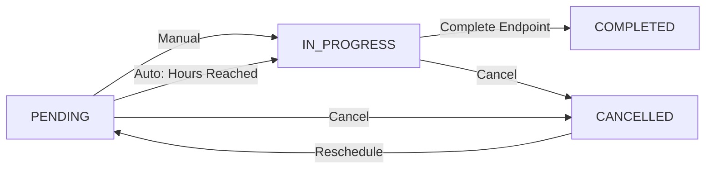

## Overview

The Aircraft Maintenance API provides comprehensive maintenance tracking capabilities including:

- **Flexible Scheduling**: Schedule by calendar date, flight hours, or both
- **Automatic Hour Triggers**: Services automatically transition to IN_PROGRESS when aircraft reaches scheduled hours
- **Maintenance Types**: Preventive, corrective, and major maintenance tracking
- **Parts Integration**: Link services to parts replacements and overhauls
- **Status Lifecycle**: Complete workflow from pending to completed with notifications
- **History Tracking**: Automatic maintenance history records

---

## Create Aircraft Service

<ParamField path="POST /aircraft-services" type="endpoint">
  Schedule a new maintenance service
</ParamField>

**Authentication:** Required (JWT cookie)

**Permissions:** `mantenimiento:write`

**Content Type:** `application/json`

### Request Body

<ParamField body="type" type="enum" required>
  Service type:
  - `PREVENTIVE`: Scheduled preventive maintenance
  - `CORRECTIVE`: Unscheduled corrective maintenance
  - `MAINTENANCE`: Major maintenance or overhaul
</ParamField>

<ParamField body="description" type="string" required>
  Detailed description of the maintenance work to be performed
</ParamField>

<ParamField body="aircraft_id" type="integer" required>
  ID of the aircraft to be serviced
</ParamField>

<ParamField body="scheduled_at" type="date">
  Calendar date when service is scheduled (YYYY-MM-DD)
  
  **Note:** Must provide either `scheduled_at`, `scheduled_at_hours`, or both
</ParamField>

<ParamField body="scheduled_at_hours" type="number">
  Absolute flight hours (total_lifetime_hours) when service should be performed
  
  **Requirements:**
  - Must be greater than aircraft's current `total_lifetime_hours`
  - Service will automatically transition to `IN_PROGRESS` when aircraft reaches these hours
  
  **Note:** Must provide either `scheduled_at`, `scheduled_at_hours`, or both
</ParamField>

<ParamField body="emails_to_notify" type="array">
  Array of email addresses to notify about service status changes
  
  Example: `["mechanic@example.com", "manager@example.com"]`
</ParamField>

<ParamField body="phones_to_notify" type="array">
  Array of phone numbers to notify via SMS
  
  Example: `["+1234567890", "+0987654321"]`
</ParamField>

<ParamField body="status" type="enum" default="PENDING">
  Initial service status:
  - `PENDING`: Service is scheduled
  - `IN_PROGRESS`: Service is actively being performed
  - `COMPLETED`: Service is finished
  - `CANCELLED`: Service was cancelled
</ParamField>

<ParamField body="completed_at" type="date">
  Date when service was completed (for historical records)
</ParamField>

### Response

<ResponseField name="message" type="string">
  Success message
</ResponseField>

<ResponseField name="aircraftService" type="object">
  Created service object
  
  <ResponseField name="id" type="integer">
    Unique service identifier
  </ResponseField>
  
  <ResponseField name="type" type="string">
    Service type
  </ResponseField>
  
  <ResponseField name="description" type="string">
    Service description
  </ResponseField>
  
  <ResponseField name="status" type="string">
    Current service status
  </ResponseField>
  
  <ResponseField name="scheduled_at" type="date">
    Scheduled date (if applicable)
  </ResponseField>
  
  <ResponseField name="scheduled_at_hours" type="number">
    Scheduled hours threshold (if applicable)
  </ResponseField>
  
  <ResponseField name="hours_snapshot_at_creation" type="number">
    Aircraft's total_lifetime_hours when service was created
  </ResponseField>
  
  <ResponseField name="registered_by" type="object">
    User who created the service (from JWT)
  </ResponseField>
  
  <ResponseField name="created_at" type="datetime">
    Creation timestamp
  </ResponseField>
</ResponseField>

### Example Requests

**Schedule by Calendar Date:**
```bash
curl -X POST https://api.sigsaho.com/aircraft-services \
  -H "Content-Type: application/json" \
  --cookie "auth-token=YOUR_JWT_TOKEN" \
  -d '{
    "type": "PREVENTIVE",
    "description": "100-hour inspection including engine compression check",
    "aircraft_id": 1,
    "scheduled_at": "2026-06-30",
    "emails_to_notify": ["mechanic@example.com"],
    "phones_to_notify": ["+1234567890"]
  }'
```

**Schedule by Flight Hours:**
```bash
curl -X POST https://api.sigsaho.com/aircraft-services \
  -H "Content-Type: application/json" \
  --cookie "auth-token=YOUR_JWT_TOKEN" \
  -d '{
    "type": "PREVENTIVE",
    "description": "2200-hour major engine overhaul",
    "aircraft_id": 1,
    "scheduled_at_hours": 2200,
    "emails_to_notify": ["maintenance@example.com", "director@example.com"]
  }'
```

**Schedule by Both Date and Hours:**
```bash
curl -X POST https://api.sigsaho.com/aircraft-services \
  -H "Content-Type: application/json" \
  --cookie "auth-token=YOUR_JWT_TOKEN" \
  -d '{
    "type": "MAINTENANCE",
    "description": "Annual inspection or 500 hours, whichever comes first",
    "aircraft_id": 1,
    "scheduled_at": "2026-12-31",
    "scheduled_at_hours": 5500,
    "emails_to_notify": ["ops@example.com"]
  }'
```

---

## List Aircraft Services

<ParamField path="GET /aircraft-services" type="endpoint">
  Retrieve paginated list of maintenance services with filters
</ParamField>

**Authentication:** Required (JWT cookie)

**Permissions:** `mantenimiento:read`

### Query Parameters

<ParamField query="page" type="integer" default="1">
  Page number (minimum: 1)
</ParamField>

<ParamField query="limit" type="integer" default="10">
  Records per page (minimum: 1, maximum: 100)
</ParamField>

<ParamField query="status" type="enum">
  Filter by service status:
  - `PENDING`
  - `IN_PROGRESS`
  - `COMPLETED`
  - `CANCELLED`
</ParamField>

<ParamField query="type" type="enum">
  Filter by service type:
  - `PREVENTIVE`
  - `CORRECTIVE`
  - `MAINTENANCE`
</ParamField>

<ParamField query="aircraft_id" type="integer">
  Filter by aircraft ID
</ParamField>

<ParamField query="search" type="string">
  Search by description text
</ParamField>

### Response

<ResponseField name="data" type="array">
  Array of aircraft service objects
</ResponseField>

<ResponseField name="pagination" type="object">
  Pagination metadata (page, limit, total, totalPages, hasNextPage, hasPreviousPage)
</ResponseField>

### Example Request

```bash
curl -X GET "https://api.sigsaho.com/aircraft-services?aircraft_id=1&status=PENDING&page=1" \
  --cookie "auth-token=YOUR_JWT_TOKEN"
```

---

## Get Service by ID

<ParamField path="GET /aircraft-services/{id}" type="endpoint">
  Retrieve detailed information for a specific service
</ParamField>

**Authentication:** Required (JWT cookie)

**Permissions:** `mantenimiento:read`

### Path Parameters

<ParamField path="id" type="integer" required>
  Service ID
</ParamField>

### Response

<ResponseField name="aircraftService" type="object">
  Complete service object including:
  - Service details (type, description, status)
  - Scheduling information (scheduled_at, scheduled_at_hours)
  - Associated aircraft and user information
  - Notification configurations
  - Linked documents and parts
  - Timestamps
</ResponseField>

### Example Request

```bash
curl -X GET https://api.sigsaho.com/aircraft-services/5 \
  --cookie "auth-token=YOUR_JWT_TOKEN"
```

---

## Get Service Hours Status

<ParamField path="GET /aircraft-services/{id}/hours-status" type="endpoint">
  Get real-time progress for hour-scheduled services
</ParamField>

**Authentication:** Required (JWT cookie)

**Permissions:** `mantenimiento:read`

**Note:** Only works for services scheduled with `scheduled_at_hours`. Returns 422 error for date-only scheduled services.

### Path Parameters

<ParamField path="id" type="integer" required>
  Service ID
</ParamField>

### Response

<ResponseField name="hoursStatus" type="object">
  Hour-based progress information
  
  <ResponseField name="scheduled_at_hours" type="number">
    Target hours threshold for this service
  </ResponseField>
  
  <ResponseField name="current_hours" type="number">
    Aircraft's current total_lifetime_hours
  </ResponseField>
  
  <ResponseField name="hours_remaining" type="number">
    Hours remaining until service is due (0 if overdue)
  </ResponseField>
  
  <ResponseField name="hours_at_creation" type="number">
    Snapshot of aircraft hours when service was created
  </ResponseField>
  
  <ResponseField name="is_overdue_by_hours" type="boolean">
    Whether aircraft has reached or exceeded scheduled hours
  </ResponseField>
  
  <ResponseField name="percentage_reached" type="number">
    Percentage of scheduled hours reached (0-100+)
    
    Formula: `((current_hours - hours_at_creation) / (scheduled_at_hours - hours_at_creation)) * 100`
  </ResponseField>
</ResponseField>

### Example Request

```bash
curl -X GET https://api.sigsaho.com/aircraft-services/5/hours-status \
  --cookie "auth-token=YOUR_JWT_TOKEN"
```

### Example Response

```json
{
  "hoursStatus": {
    "scheduled_at_hours": 5100,
    "current_hours": 5047,
    "hours_remaining": 53,
    "hours_at_creation": 5000,
    "is_overdue_by_hours": false,
    "percentage_reached": 47.0
  }
}
```

---

## Update Service Status

<ParamField path="PATCH /aircraft-services/{id}/status" type="endpoint">
  Change the status of a service
</ParamField>

**Authentication:** Required (JWT cookie)

**Permissions:** `mantenimiento:write`

### Path Parameters

<ParamField path="id" type="integer" required>
  Service ID
</ParamField>

### Request Body

<ParamField body="status" type="enum" required>
  New service status:
  - `PENDING`: Return service to scheduled state
  - `IN_PROGRESS`: Mark service as actively being performed
  - `COMPLETED`: Mark service as finished (prefer using `/complete` endpoint)
  - `CANCELLED`: Cancel the service
</ParamField>

### Response

<ResponseField name="message" type="string">
  Confirmation message
</ResponseField>

<ResponseField name="aircraftService" type="object">
  Updated service object
</ResponseField>

### Example Request

```bash
curl -X PATCH https://api.sigsaho.com/aircraft-services/5/status \
  -H "Content-Type: application/json" \
  --cookie "auth-token=YOUR_JWT_TOKEN" \
  -d '{"status": "IN_PROGRESS"}'
```

---

## Complete Service

<ParamField path="PATCH /aircraft-services/{id}/complete" type="endpoint">
  Complete a service and execute maintenance reset logic
</ParamField>

**Authentication:** Required (JWT cookie)

**Permissions:** `mantenimiento:write`

**Important:** This endpoint performs critical operations:
- Sets status to `COMPLETED` and records `completed_at` timestamp
- For `MAINTENANCE` or `PREVENTIVE` services: Resets aircraft maintenance counters
- Processes associated parts (replacements, overhauls, etc.)
- Creates maintenance history records
- Triggers notifications to configured recipients

**Prerequisites:**
- Service must be in `IN_PROGRESS` status
- Cannot complete a service that hasn't been started

### Path Parameters

<ParamField path="id" type="integer" required>
  Service ID
</ParamField>

### Response

<ResponseField name="message" type="string">
  Completion confirmation message
</ResponseField>

<ResponseField name="aircraftService" type="object">
  Completed service object with updated status and completed_at timestamp
</ResponseField>

### Example Request

```bash
curl -X PATCH https://api.sigsaho.com/aircraft-services/5/complete \
  --cookie "auth-token=YOUR_JWT_TOKEN"
```

### Maintenance Reset Logic

When completing `MAINTENANCE` or `PREVENTIVE` services:

1. **Aircraft Counters Reset:**
   - `current_time_flying` → 0
   - `current_cycles` → 0
   - `hours_before_lastMantt` → current `total_lifetime_hours`
   - `last_major_maintenance_date` → today's date

2. **Parts Processing:**
   - Parts marked for replacement get their counters reset
   - Parts marked for overhaul get new life limits applied
   - Installation dates and hours are updated

3. **History Records:**
   - Maintenance event is recorded in aircraft history
   - Parts changes are documented

---

## Delete Service

<ParamField path="DELETE /aircraft-services/{id}" type="endpoint">
  Soft delete a maintenance service
</ParamField>

**Authentication:** Required (JWT cookie)

**Permissions:** `mantenimiento:write`

**Note:** Performs soft delete - sets `deleted_at` timestamp and `status=ELIMINATED`

### Path Parameters

<ParamField path="id" type="integer" required>
  Service ID to delete
</ParamField>

### Response

<ResponseField name="message" type="string">
  Deletion confirmation message
</ResponseField>

### Example Request

```bash
curl -X DELETE https://api.sigsaho.com/aircraft-services/5 \
  --cookie "auth-token=YOUR_JWT_TOKEN"
```

---

## Service Status Lifecycle



**Status Descriptions:**

- **PENDING**: Service is scheduled and waiting
  - Automatically transitions to IN_PROGRESS when `scheduled_at_hours` is reached
  - Can be manually transitioned to IN_PROGRESS

- **IN_PROGRESS**: Service is actively being performed
  - Aircraft typically has `status=MAINTENANCE`
  - Can be completed via `/complete` endpoint
  - Can be cancelled if needed

- **COMPLETED**: Service has been finished
  - Maintenance counters have been reset (for MAINTENANCE/PREVENTIVE)
  - History records created
  - Cannot be reopened (create new service instead)

- **CANCELLED**: Service was cancelled before completion
  - Can be rescheduled by creating a new service
  - Preserved for audit purposes

---

## Automatic Hour-Based Triggers

When you schedule a service with `scheduled_at_hours`, the system automatically monitors aircraft flight hours:

### How It Works

1. **Service Creation**: You set `scheduled_at_hours: 5100`
2. **Flight Records**: Each time flight hours are logged, system checks all pending services
3. **Automatic Transition**: When aircraft `total_lifetime_hours >= 5100`, service status changes to `IN_PROGRESS`
4. **Notifications**: Configured recipients are notified via email/SMS
5. **Aircraft Status**: Aircraft may automatically change to `MAINTENANCE` status

### Monitoring Progress

Use the `/hours-status` endpoint to monitor progress:

```bash
# Check how close aircraft is to scheduled maintenance
curl -X GET https://api.sigsaho.com/aircraft-services/5/hours-status \
  --cookie "auth-token=YOUR_JWT_TOKEN"
```

Response shows:
- Hours remaining until service is due
- Percentage of interval completed
- Whether service is overdue

---

## Parts Integration

Maintenance services can be linked to aircraft parts for comprehensive tracking:

### Linking Parts to Services

Parts can be associated with services through the `service-parts` junction table:

- **Parts Replaced**: Track which parts were replaced during service
- **Parts Overhauled**: Record overhaul events for parts
- **Life Limit Extensions**: Update part life limits after overhaul

### Example Workflow

1. Create maintenance service
2. Add parts to service via service-parts API
3. Complete service
4. System automatically:
   - Resets part counters for replacements
   - Updates part life limits for overhauls
   - Records part service history

---

## Best Practices

### Scheduling Strategies

**Calendar-Based Scheduling:**
```json
{
  "type": "PREVENTIVE",
  "description": "Annual inspection",
  "scheduled_at": "2026-12-31"
}
```
Best for:
- Annual inspections
- Calendar-mandated maintenance
- Certificate renewals

**Hour-Based Scheduling:**
```json
{
  "type": "PREVENTIVE",
  "description": "100-hour inspection",
  "scheduled_at_hours": 5100
}
```
Best for:
- Hour-interval maintenance
- Engine overhauls
- Component replacements

**Combined Scheduling (Whichever Comes First):**
```json
{
  "type": "PREVENTIVE",
  "description": "Annual or 500 hours",
  "scheduled_at": "2026-12-31",
  "scheduled_at_hours": 5500
}
```
Best for:
- Regulatory requirements ("annual or 100 hours")
- Conservative maintenance programs

### Notification Strategy

<Tip>
  Configure multiple notification recipients for critical maintenance:
  
  ```json
  {
    "emails_to_notify": [
      "mechanic@example.com",
      "ops-manager@example.com",
      "director@example.com"
    ],
    "phones_to_notify": ["+1234567890"]
  }
  ```
</Tip>

### Service Descriptions

Write clear, detailed descriptions:

```json
// Good
{
  "description": "2200-hour engine overhaul - Rolls-Royce 250-C20B, S/N 12345. Replace all hot section components, inspect compressor, replace oil pump per SB 250-123."
}

// Avoid
{
  "description": "Engine work"
}
```

### Completing Services

<Warning>
  Always use the `/complete` endpoint rather than just changing status to COMPLETED.
  
  The complete endpoint executes critical business logic:
  - Resets maintenance counters
  - Processes parts changes
  - Creates history records
  - Sends notifications
  
  Simply changing status to COMPLETED bypasses this logic.
</Warning>

---

## Common Workflows

### Schedule Preventive Maintenance at 2000 Hours

```bash
# 1. Create the service
curl -X POST https://api.sigsaho.com/aircraft-services \
  -H "Content-Type: application/json" \
  --cookie "auth-token=YOUR_JWT_TOKEN" \
  -d '{
    "type": "PREVENTIVE",
    "description": "2000-hour major inspection",
    "aircraft_id": 1,
    "scheduled_at_hours": 2000,
    "emails_to_notify": ["maintenance@example.com"]
  }'

# 2. Monitor progress periodically
curl -X GET https://api.sigsaho.com/aircraft-services/10/hours-status \
  --cookie "auth-token=YOUR_JWT_TOKEN"

# 3. When service auto-transitions to IN_PROGRESS (or manually start it):
curl -X PATCH https://api.sigsaho.com/aircraft-services/10/status \
  -H "Content-Type: application/json" \
  --cookie "auth-token=YOUR_JWT_TOKEN" \
  -d '{"status": "IN_PROGRESS"}'

# 4. After maintenance is complete:
curl -X PATCH https://api.sigsaho.com/aircraft-services/10/complete \
  --cookie "auth-token=YOUR_JWT_TOKEN"
```

### Handle Unscheduled Corrective Maintenance

```bash
# 1. Create corrective service (no scheduling needed)
curl -X POST https://api.sigsaho.com/aircraft-services \
  -H "Content-Type: application/json" \
  --cookie "auth-token=YOUR_JWT_TOKEN" \
  -d '{
    "type": "CORRECTIVE",
    "description": "Emergency repair - hydraulic leak in tail rotor servo",
    "aircraft_id": 1,
    "status": "IN_PROGRESS",
    "emails_to_notify": ["emergency@example.com"]
  }'

# 2. Complete when fixed:
curl -X PATCH https://api.sigsaho.com/aircraft-services/11/complete \
  --cookie "auth-token=YOUR_JWT_TOKEN"
```

### View All Pending Maintenance for Fleet

```bash
curl -X GET "https://api.sigsaho.com/aircraft-services?status=PENDING&type=PREVENTIVE&limit=100" \
  --cookie "auth-token=YOUR_JWT_TOKEN"
```
